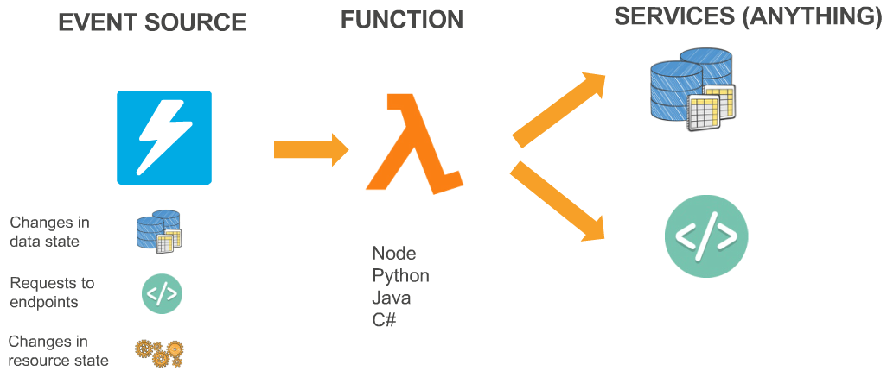
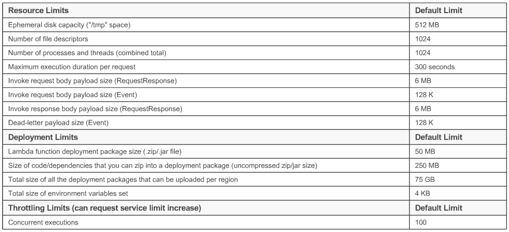
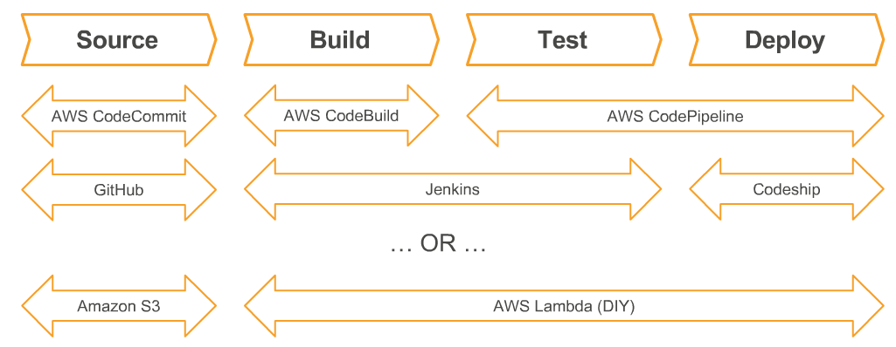

# AWS Lambda Webinar

**Capabilities, benefits, and best practices**

Date: 1/18/17

Presenter: Vyom Nagrani

## Agenda
- Working with AWS Lambda
- development and testing
- deployment and alm
- security and scaling
- debugging and operations
- Q & A

# Working with AWS Lambda

## Benefits

- productivity-focused compute platform to build powerful, dynamic, modular applications in the cloud
- no infrastructure to manage
- cost-effective and efficient
- bring your own code

## Event sources that trigger AWS

### Data Stores

- Amazon S3
- Amazon DynamoDB
- Amazon Kinesis
- Amazon Cognito

### Endpoints

- Amazon Alexa
- Amazon API Gateway
- AWS IoT

### Configuration Repositories

- AWS CloudFormation
- AWS CloudTrail
- AWS CodeCommit
- Amazon CloudWatch

### Event/Message Services

- Amazon SES
- Amazon SNS
- Amazon Cron events

## Key scenarios and use cases for AWS Lambda

### Data Processing

- stateless processing of discrete or streaming updates to your data-store or message bus

### App backend development

- execute server side backend logic for web, mobile, device, or voice user interactions

### Control systems

- customize responses and response workflows to state and data changes within AWS

# Development and testing on AWS Lambda

## Getting Started
### Bring your own code
- Node.js 4.3, Java 8, Python 2.7, C#

### Simple resource model
- select power rating from 128 MB to 1.5 GB
- CPU and network allocated proportionately

### Flexible use
- synchronous or asynchronous
- integrated with other AWS services

### Stateless
- Persist data using external storage
- no affinity or access to underlying infrastructure

## Anatomy of a Lambda function

### `Handler()` function

- the method in your code where AWS Lambda begins execution

### Event object

- Pre-defined object format for AWS integrations & events
- Java & C# support simplet data types, POJOs/POCOs, and Stream input/output

### Context object

- use methods and properties like `getRemainingTimeInMillis()`,` identity`, `awsRequestId`, `invokedFunctionArn`, `clientContext`, `logStreamName`

## FunctionConfiguration metadata

### VpcConfig

- enables private communication with other resources within your VPC
- provide EC2 security group and subnets, auto-creates ENIs
- Internet access can be added through NAT Gateway

### DeadLetterConfig

- failed events sent to your SQS queue / SNS topic
- redrive messages that Lambda could not process
- Currently available for asynchronous invocations only

### Environment

- Add custom key/value pairs as part of configuration
- reuse code across different setups or passwords
- encrypted with specified KMS key on server, decrypted at container init

## AWS Lambda Limits

## The container model

### Container reuse

- declarations in your Lambda function code outside handler()
- disk content in /tmp
- Background processes or callbacks
- make use of container reuse opportunistically, e.g.
  - load additional libraries
  - cache static data
  - database connections

### Cold starts

- time to set up a new container ad do necessary bootstrapping when a Lambda function is invoked for the first time or after it has been updated
- Ways to reduce cold start latency
  - more memory = faster performance, lower startup time
  - smaller function ZIP loads faster
  - Node.js and Python start execution faster than Java and C#

## The execution environment

### Underlying OS

- public Amazon Linux AMI version (amen-ami-hvm-)
- Linux kernel version
- Compile native binaries against this environment - can be used to bring your own runtime!
- Changes over time, always check the latest versions supported here http://docs.aws.amazon.com/lambda/latest/dg/current-supported-versions.html

### Available libraries

- ImageMagick (node.js wrapper and native binary)
- OpenJDK 1.8, .NET Core 1.0.1
- AWS SDK for javascript

# Deployment

## Building a deployment package

### Node.js & Python

- .zip file consisting of your code and any dependencies
- use npm/pip to install libraries
- all dependencies must be at root level

### Java

- either .zip file with all code/dependencies or standalone jar

## Managing continuous delivery

## Deployment tools and frameworks available

### CloudFormation

- AWS Serverless Application Model - extension optimized for Serverless
- New Serverless resources - APIs, Functions, Tables
- Open specification (Apache 2.0)

### Chalice

- Python serverless micro-framework
- Quickly create and deploy applications
- Set up AWS Lambda and Amazon API Gateway endpoint
- https://github.com/awslabs/chalice

### Third-party tools

- Serverless Framework http://serverless.com
- Apex Serverless Architecture http://apex.run
- DEEP Framework by Mitoc Group https://github.com/MitocGroup/deep-framework

## Function versioning and aliases

- versions = immutable copies of code + configuration
- aliases = mutable pointers to versions
- development against $LATEST version
- each version/alias gets its own ARN
- enables rollbacks, staged promotions, "locked" behavior for client

# Security and Scaling

## The push model and resource policies

### Function (resource) policy

- permissions you grant to your Lambda function determine which service or event source can invoke your function
- resource policies make it easy to grant cross-account permissions to invoke your Lambda function

## The pull model and IAM roles

### IAM (execution) role

- Permissions you grant to this role determine what your AWS Lambda function can do
- If event source is...

## Concurrent executions and throttling

### Determining concurrency

- <u>For stream-based event sources</u>: number of shards per stream is the unit of concurrency
- <u>For all other event sources</u>: Request rate and duration drives concurrency (concurrency = requests per second * duration)

### Throttle behavior

- <u>For stream-based event sources</u>: automatically retried until data expires
- <u>For Asynchronous invocations</u>: automatically retried for up to six hours with delays between retries
- <u>For synchronous invocations:</u>: Invoking application receives a 429 error and is responsible for  retries

## Other scaling considerations

### For lambda

- remember, a throttle is NOT an error!
- if you expect sudden large spikes in demand, consider async invocations to Lambda
- proactively engage AWS Support to increase your throttling limits

### For upstream/downstream services

- build retries/backoff in client apps
- make sure your downstream setup keeps up
- limit concurrency when connecting to relational dbs

# Debugging and Operations

## Errors and retries

### Types of errors

- 4xx Client Error: can be fixed by developer
- 5xx Server Error: Most can be fixed by admin, e.g. EC2 ENI management errors (502)

### Retry Policy

- <u>For stream-based event sources</u>: Automatically retried until data expires
- <u>For Asynchronous invocations</u>: Automatically retried 2 extra times, then published to dead-letter queue
- <u>For Synchronous invocations</u>: Invoking application receives an error code

## Tracing and tracking

### Integration with AWS X-Ray (coming soon)

- collects data about requests that your application serves
- visibility into the AWS Lambda service (dwell time, number of retries, latency, and errors)
- detailed breakdown of your function's performance, including calls made to downstream services and endpoints

### Integrations with AWS CloudTrail

- capture calls made to AWS Lambda API; deliver log files to Amazon S3
- tracks the request made to AWS Lambda, the source IP address form which the request was made, who made the request, when it was made
- All control plane APIs can be tracked ...

## Troubleshooting and monitoring

### Logs

- every invocation generates START, END, and REPORT entries in CloudWatch Logs
- User logs included

### Metrics

- <u>Default (free) Metrics</u>: Invocations, Duration, Throttles, Errors - available as CloudWatch Metrics
- <u>Additional Metrics</u>: Create custom metrics for tracking health/status
  - Function code vs log-filters
  - ops-centric vs. business-centric

# Conclusion and next steps

<u>Key Takeaway</u>

AWS Lambda is one of the core components of the platform AWS provides to develop serverless applications
